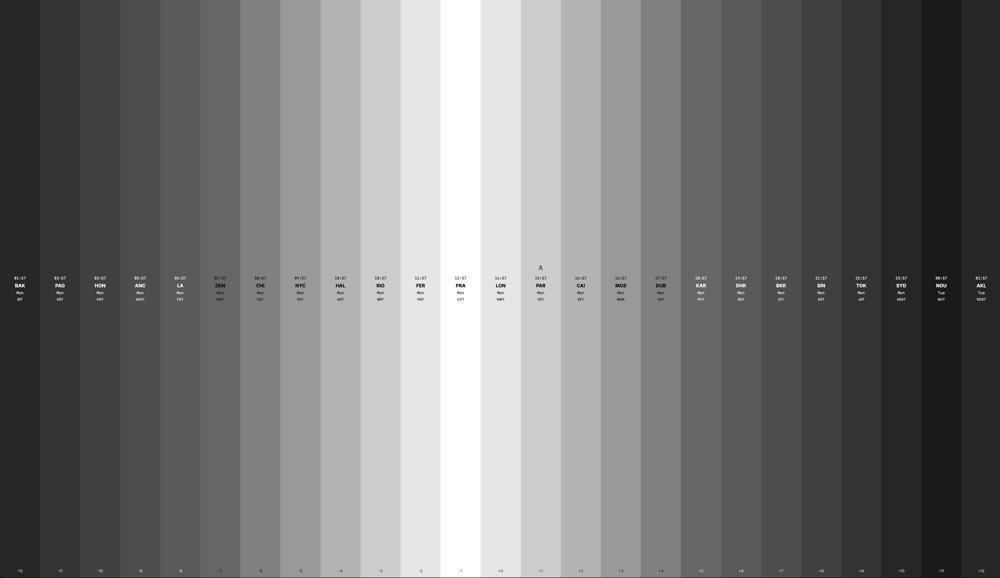

# tzc - time zone converter



interactive visualization of world time zones with draggable interface and gradient background representing day/night cycles.

## 🔥 new: slack & discord integrations
automatically convert timezone mentions in both slack and discord messages! just type patterns like `3PM CEST -> EST` and get instant conversions.

### features:
- **auto-detection**: recognizes patterns like `3PM EST -> PST` in messages
- **slack thread replies**: clean, non-intrusive responses in message threads  
- **discord replies**: contextual replies to messages with timezone conversions
- **slash commands**: use `/tz 3pm EST to PST` in both platforms for manual conversions
- **rich embeds**: beautiful discord embeds with timezone conversion results
- **multiple formats**: supports 12/24 hour, city names, timezone codes

*built with [v0.dev](https://v0.dev) and [claude code](https://claude.ai/code)*

[](https://vercel.com/bartosz-jarockis-projects/v0-50-shades-of-time)
[](https://v0.dev/chat/projects/sTNJefUlSQC)

## features

- **gradient background**: each time zone shows a shade representing local time (dark for night, light for day)
- **drag interaction**: click and drag to explore different times across all zones
- **responsive design**: horizontal layout on desktop, vertical on mobile  
- **live updates**: real-time clock updates
- **user timezone detection**: highlights your current timezone with an orange dot

## quick start

```bash
# Install dependencies
pnpm install

# Start development server
pnpm dev
```

Open [http://localhost:3000](http://localhost:3000)

## code quality

this project uses [biome](https://biomejs.dev/) for ultra-fast linting and formatting:

```bash
# Check for issues
pnpm check

# Auto-fix issues
pnpm check:fix

# Format code
pnpm format:fix

# Lint only
pnpm lint:fix
```

## tech stack

### frontend
- **next.js 15** with app router
- **react 19** 
- **typescript**
- **tailwind css**
- **date-fns-tz** for timezone handling
- **framer motion** for animations

### backend & integrations
- **slack web api** for slack bot integration
- **discord.js** for discord bot integration
- **chrono-node** for natural language time parsing
- **next.js api routes** for slack/discord webhooks

### development tools
- **biome** for ultra-fast linting and formatting
- **pnpm** for package management
- **vercel** for deployment

## how it works

the app displays 25 time zones (UTC-12 to UTC+12) as colored strips. each strip's color corresponds to the local hour:
- darker shades = nighttime (6 PM - 6 AM)
- lighter shades = daytime 
- brightest = noon

drag horizontally (desktop) or vertically (mobile) to "time travel" and see how all zones change together.

## development

### code quality standards
- **100% typescript** with strict type checking
- **biome** enforced code style and linting
- **modern es2020+** features throughout
- **react best practices** with proper hook usage

### architecture
- **api routes**: `/api/slack/*` for slack integration, `/api/discord/*` for discord integration
- **utilities**: modular timezone and parsing logic shared between platforms
- **components**: clean separation of ui and business logic

## continue building

**[https://v0.dev/chat/projects/sTNJefUlSQC](https://v0.dev/chat/projects/sTNJefUlSQC)**
